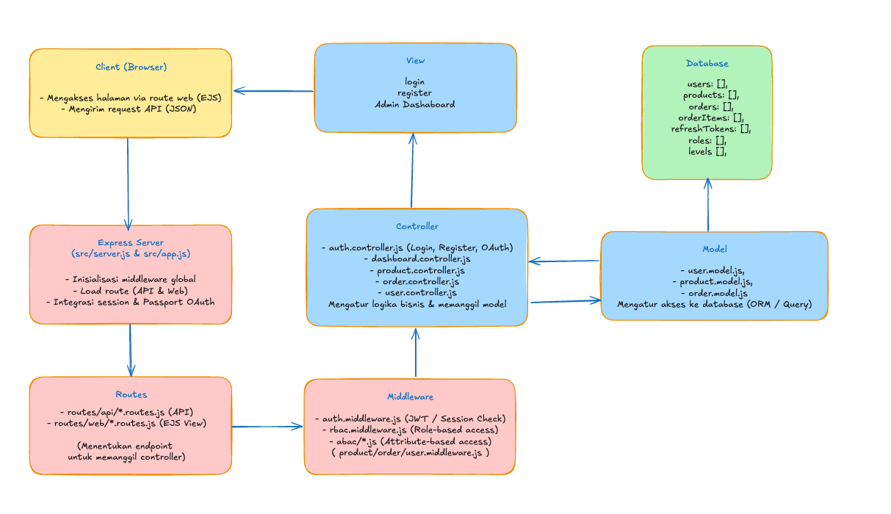
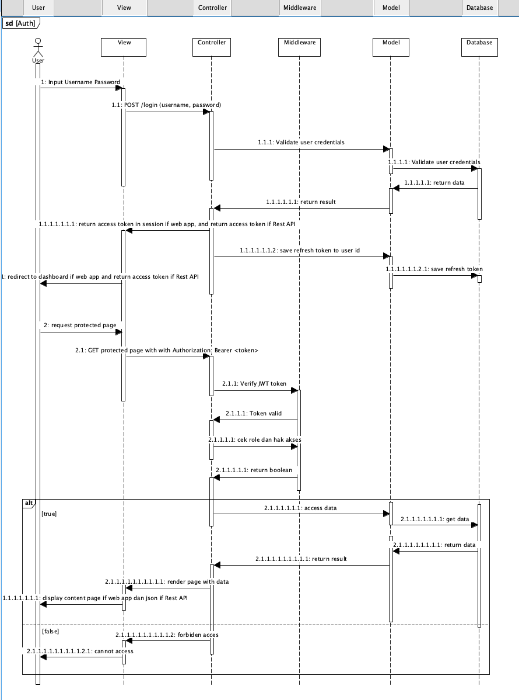
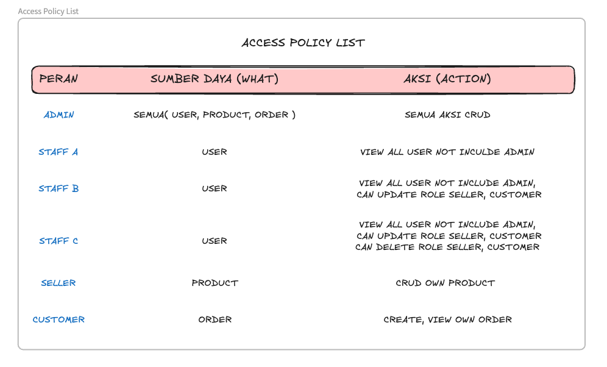
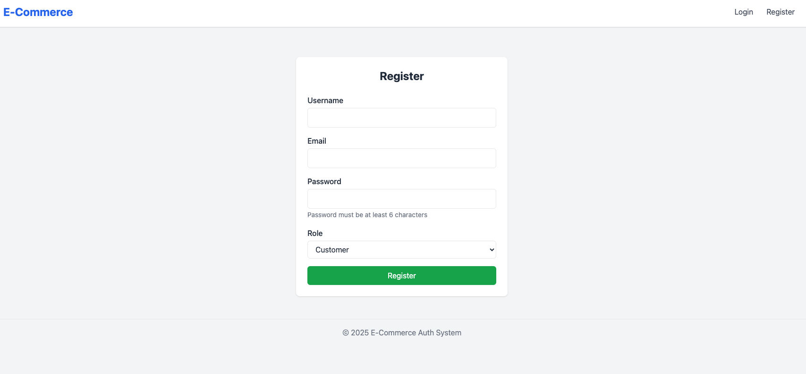

# 🛒 Ecommerce-MVC

Proyek tugas **ALP Cyber Security** – aplikasi e-commerce sederhana menggunakan arsitektur **MVC** dengan autentikasi **Google OAuth 2.0**, dibangun menggunakan **Node.js**, **Express**, dan **EJS**.

---

## Design Arsitektur Sistme




## Struktur Proyek

- Entry point: `src/server.js`
- View engine: `EJS`
- Framework: `Express v5`
- Autentikasi: `Passport (Google OAuth 2.0)`
- Session: `express-session`
- Password hashing: `bcryptjs`

## Access Policy List



---

## 🛠️ Instalasi

### 1. Clone Repository

```bash
git clone <URL_REPOSITORY>
cd ecommerce-mvc
```

### 2. Install Dependencies

```bash
npm install
```

### 3. Buat file .env

```bash
PORT=3000

JWT_SECRET=your_supersecret_jwt
JWT_REFRESH_SECRET=your_supersecret_refresh
ACCESS_EXPIRES_IN=1h
REFRESH_EXPIRES_IN=7d

SESSION_SECRET=your_session_secret_key
GOOGLE_CLIENT_ID=your_client_id
GOOGLE_CLIENT_SECRET=your_client_secret
GOOGLE_CALLBACK_URL=http://localhost:3000/auth/google/callback
```

### 4. Jalan Program Berdasarkan Mode yang diinginkan

#### 1. Mode Development

```bash
npm run dev
```

#### 2. Mode Production

```bash
npm start
```

### Dokumentasi penggunaan Rest API Link

[Dokumentasi Postman](https://documenter.getpostman.com/view/37267696/2sB3QNp8Mh)

```bash
https://documenter.getpostman.com/view/37267696/2sB3QNp8Mh
```

## 📸 Screenshot (Opsional)




